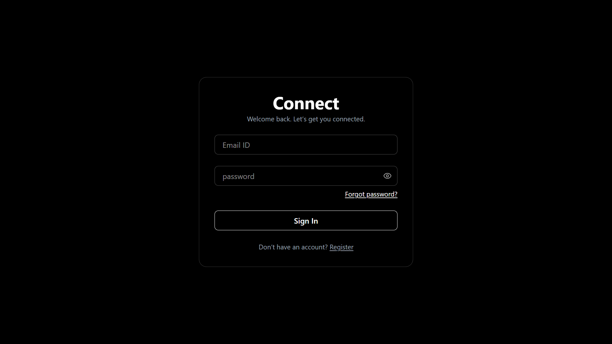
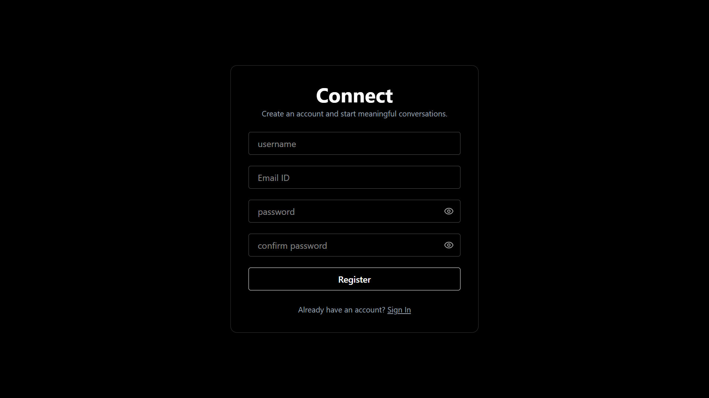
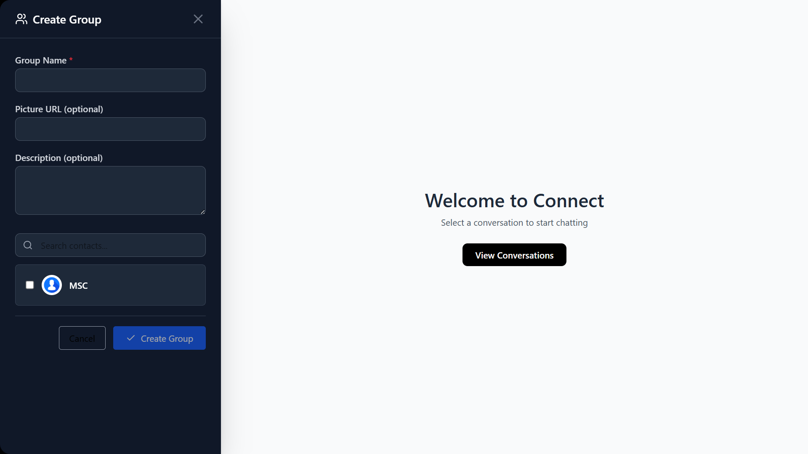
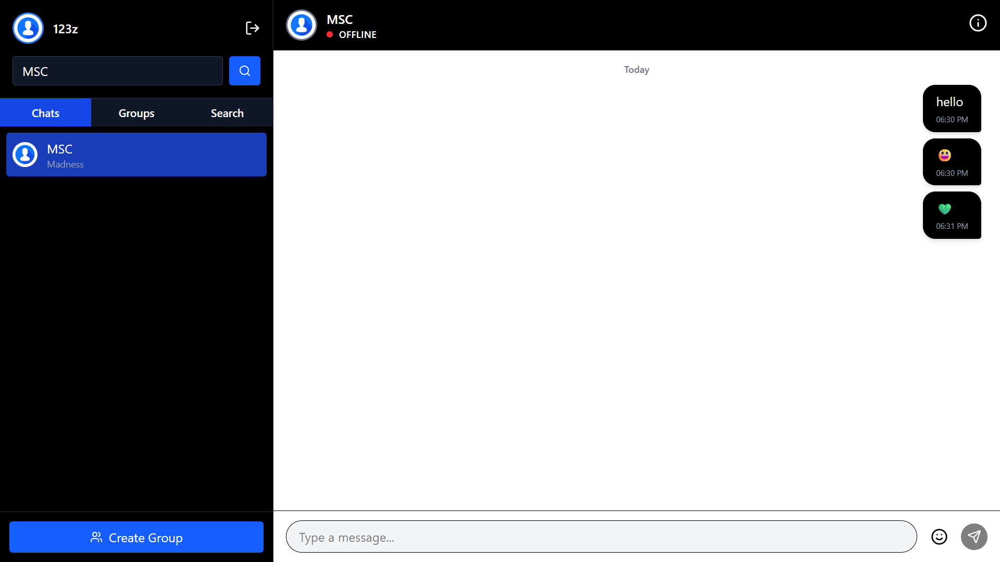

# 💬 Connect - Real-Time Chat App

🌐 Live Demo: [https://chat-app-connect-eight.vercel.app](https://chat-app-connect-eight.vercel.app)

Connect is a modern, secure, and responsive real-time chat application built with React and Node.js. It enables seamless one-on-one and group messaging with live updates, user authentication, and an intuitive interface for desktop and mobile devices.

Whether you're connecting with friends or collaborating with teams, Connect offers a smooth, interactive experience powered by WebSocket technology for instant communication.

## 📁 Project Structure

<pre>
💬 Connect/
├── 📸 screenshots/             # 📷 Screenshots used in README
├── 🖥️ backend/                 # 🧠 Node.js + Express API
│   ├── 🧩 config/              # ⚙️ DB connection, env config
│   ├── 🧬 models/              # 📄 Mongoose models (User, Message, Group)
│   ├── 🛣️ routes/             # 🚏 API endpoints (auth, groups, users)
│   ├── 🛡️ middleware/         # 🔐 Authentication middlewares
│   ├── 📄 .env                 # 🔐 Backend environment (MONGO_URI, JWT)
│   └── 🚀 index.js            # 🔥 Entry point of backend server
├── 💻 frontend/               # 🎨 React + Tailwind UI
│   ├── 📁 public/             # 🌐 Static assets
│   ├── 🖼️ src/                # 💡 Application source
│   │   ├── 🧠 App.jsx         # 🎯 Root component
│   │   ├── 🌐 context/        # 🔌 Auth & socket contexts
│   │   ├── 💬 chat/           # 📱 Chat UI components
│   │   ├── 🧑 profile/        # 👤 User profile management
│   │   ├── 📄 pages/          # 📄 Routes (Login, Register, 404)
│   │   ├── 🎨 assets/         # 🖼️ Icons, logos, images
│   │   ├── 📄 main.jsx        # 🚀 ReactDOM entry point
│   │   ├── 🎨 App.css         # 💅 Base styling
│   │   ├── 📄 .env            # ⚙️ Frontend env (VITE_API_URL)
│   │   └── 📄 index.css       # 🎨 Tailwind + custom styles
├── ⚙️ vite.config.js           # ⚙️ Vite project configuration
├── 📦 package.json             # 📦 Project metadata & scripts
└── 📝 README.md                # 📘 Project description and guide
</pre>
## 🚀 Features

- 🔐 **Authentication & Authorization**  
  Secure user registration, login, and role-based access using JWT tokens.

- 💬 **Real-Time Toast Notifications**  
  Instant feedback for actions.

- 🧠 **State Management with Context API**  
.Efficient global state sharing for Users with auth-context and socket-context for gtoup and contact sharing.

- 🎨 **Stylish UI with Tailwind CSS + Framer Motion**  
  Beautifully animated, responsive design with modern interactions.

- 🔗 **Routing with React Router**  
  Protected routes managed via routing.

- ☁️ **Deployed on Vercel & Render**  
  Frontend hosted on Vercel, backend on Render for full-stack deployment.

---

## 🧰 Tech Stack & Tools

| Tech             | Purpose                                      |
|------------------|----------------------------------------------|
| React.js         | Frontend framework                          |
| Tailwind CSS     | Styling with utility-first CSS              |
| Framer Motion    | Animations and transitions                  |
| React Router     | Client-side routing                         |
| Context API      | Global state management                     |
| Axios            | HTTP requests to the backend                |
| Express.js       | Backend web framework                       |
| MongoDB & Mongoose | Database and schema modeling             |
| JWT              | Secure token-based authentication           |
| Vercel           | Hosting for frontend                        |
| Render           | Hosting for backend                         |
| Dotenv           | Environment configuration                   |

---

## 📸 Screenshots

> Below are the core screens of the Chat Application showcasing the user journey.

---

### 🔐 Login Page  
Secure login with username & password. Form validation, animations, and responsive design.

<p float="left">
  
</p>
---

### 📝 Register Page  
User registration with input validation and smooth user experience.

<p float="left">
  
</p>


---
### 👥 Group List / Rooms Page  
Displays all available chat groups. Users can join, leave, or create rooms.

<p float="left">
  
</p>

---
### 💬 Chat Window  
Realtime chat interface using **Socket.IO**. Includes:
- Message bubbles
- User avatars
- Timestamps
- Auto-scroll
- Typing indicators

<p float="left">
  
</p>

---
## 🛠️ Installation & Setup

### Prerequisites
- **Node.js** (v16 or higher) — [Download here](https://nodejs.org/)
- **MongoDB** — Use a local instance or cloud service like [MongoDB Atlas](https://www.mongodb.com/cloud/atlas)

---

### Step 1: Clone the Repository
```bash
git clone https://github.com/yourusername/chat-app-connect-eight.git
cd chat-app-connect-eight

Step 2: Install Dependencies

Backend:
cd backend
npm install

Frontend:
cd ../frontend
npm install

Step 3: Configure Environment Variables
Create .env files inside both the backend and frontend folders.

Backend .env example:

DB_URI=your_mongodb_connection_string
JWT_SECRET=your_jwt_secret_key
PORT=5000

Frontend .env example:

VITE_API_URL=http://localhost:5000/api

Step 4: Run the Application
Start backend server:

cd ../backend
npm start


Start frontend development server:

cd ../frontend
npm run dev


👤 Author
Soumayshree Rout

🔗 GitHub: @MSC-0013

🌐 Portfolio: [[Portfolio](https://port-folio-tau-coral.vercel.app)]

📬 Contact
📧 Email: <soumyashreerout99@gmail.com>

💼 LinkedIn: [Linkedin Profile]([https://](https://www.linkedin.com/in/soumyashree-rout-500671253/)
